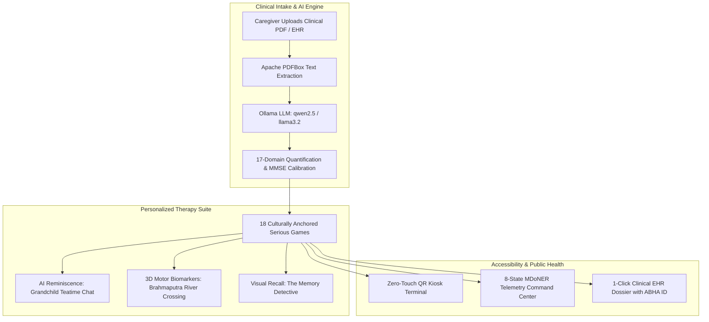

# CogniCare CDTx

> **AI-Powered Cognitive Digital Therapeutics (CDTx) & Memory Assistance Platform for Elderly Dementia Patients in the North Eastern Region (NER)**  
> *Proposed Solution for Ministry of Development of North Eastern Region (MDoNER) • Problem Statement ID: SIH26003*

---

## 🎯 Executive Summary (For PPT & Pitch Presentations)

CogniCare is a clinically calibrated, culturally anchored Cognitive Digital Therapeutics (CDTx) platform engineered specifically for elderly dementia, Alzheimer's, and Mild Cognitive Impairment (MCI) patients in the 8 North Eastern states of India.

It combines **18 serious cognitive games**, **local Ollama LLM clinical report extraction & conversational reminiscence**, **11 regional languages with zero-flicker switching**, **zero-touch QR kiosk authentication**, **continuous neuropsychological motor biomarkers**, and an **8-State Regional Telemetry Command Center**.



---

## 🌟 Key Platform Innovations

### 1. 🎮 18 Clinical Serious Games Suite
- **AI Reminiscence Dialogue**: *The Grandchild's Teatime Chat* — Multi-turn conversational memory recall powered by local Ollama LLM.
- **3-Tier Facial & Story Recall**: *The Memory Detective* — Progressive clue-based face & landmark identification.
- **3D & OpenCV Kinematics**:
  - *Brahmaputra Boat Crossing* — 3D Three.js river navigation tracking micro-hesitation motor latencies and spatial orientation.
  - *Assam Weaving Loom* — Pattern-matching cognitive test measuring motor curve smoothness and reaction time.
- **Culturally Rooted NER Games**: *Living Chronicle Storybook*, *Jigsaw Puzzle Engine*, *Cherrapunji Living Root Bridge*, *Assam Tea Leaf Harvest*, *Akashvani Vintage Radio*, *Majuli Mask Workshop*, *Loktak Floating Phumdis*, *Brahmaputra Fisher*, *Heritage Kitchen*, *Bihu Drum Rhythm*, *Hornbill Festival Headdress*, *Monastery Prayer Wheel*, *Orchid Sanctuary Match*, *Village Wayfinding*.

### 2. 🤖 Local Ollama AI Clinical Pipeline
- **17-Domain Quantification**: Extracts 7 cognitive domains, 6 Instrumental Activities of Daily Living (IADLs), and 4 behavioral markers from medical reports.
- **Rule-Based MMSE/MoCA Calibration**: Automatically sets initial game difficulty (Level 1 Assisted, Level 2 Moderate, Level 3 Adaptive).
- **100% On-Device / Offline Privacy**: Zero patient health information leaves the local clinic or device.

### 3. 🌐 11 Regional Languages & Zero-Flicker Architecture
- Supports **8 North Eastern and Pan-Indian languages**: *Assamese (অসমীয়া), Bengali (বাংলা), Hindi (हिन्दी), Marathi (मराठी), Khasi, Garo, Manipuri (মৈতৈলোন্), Mizo, Bodo, Nepali, and English*.
- **Zero-Flicker Switching**: Built with React 19 `useTransition` and SSR-safe `useSyncExternalStore` state persistence.

### 4. 🪪 Zero-Touch QR Kiosk Login (`/kiosk/login`)
- **Optical Laser Reticle**: Real-time camera viewfinder with glowing targeting brackets and sweeping laser line.
- **Multi-Sensory Audio**: Web Audio scanner beeps (`playScanSuccess`, `playError`) and spoken voice greeting.
- **Instant Optical Authentication**: Validates cryptographic QR card token and transitions seamlessly to the daily therapy dashboard.

### 5. 📊 8-State MDoNER Telemetry & Command Center (`/command-center`)
- Real-time GIS adherence and epidemiology dashboard covering *Assam, Meghalaya, Manipur, Mizoram, Nagaland, Tripura, Arunachal Pradesh, and Sikkim*.
- Live WebSocket session feed and Ayushman Bharat Digital Mission (ABDM/ABHA ID) compatibility.

### 6. ♿ GIGW AAA Accessibility Toolbar
- 3-tier elderly font scaling (**`16px` / `18px` / `22px`**).
- High-Contrast AAA mode for visual impairment and presbyopia.

---

## 🛠️ Technical Stack

| Layer | Technologies | Key Highlights |
|---|---|---|
| **Frontend** | Next.js 16 (Turbopack), React 19, TypeScript, Tailwind CSS 4, Lucide Icons, Three.js | Zero-flicker i18n, Web Audio API, Web Speech TTS, Neo-brutalist clinical UI |
| **Backend** | Spring Boot 4.1, Java 17, Spring Data JPA, Hibernate, Apache PDFBox 3.0 | REST API, Multi-part upload, JWT authentication, Session management |
| **AI / LLM** | Ollama (`llama3.2:3b` / `qwen2.5:1.5b`) | Offline-first clinical report analysis, multi-turn conversational reminiscence |
| **Database** | MariaDB (Production) / H2 Embedded (Zero-Config Demo Mode) | Multi-patient medical schemas, family albums, biomarker history |

---

## 🚀 Quick Start Guide

### Prerequisites
- **Node.js** v18+ & **JDK** 17+
- **Ollama** installed (`ollama pull qwen2.5:1.5b` or `llama3.2:3b`)

### Running the Full System

```bash
# 1. Start Backend (H2 Zero-Config Demo Mode)
cd backend
./mvnw spring-boot:run -Dspring-boot.run.profiles=demo

# 2. Start Frontend
cd frontend
npm install
npm run dev
```

- **Frontend Portal**: `http://localhost:3000`
- **Kiosk QR Login**: `http://localhost:3000/en/kiosk/login`
- **Caregiver Dashboard**: `http://localhost:3000/en/caregiver`
- **MDoNER Command Center**: `http://localhost:3000/en/command-center`
- **Backend API**: `http://localhost:8080/api/v1`
