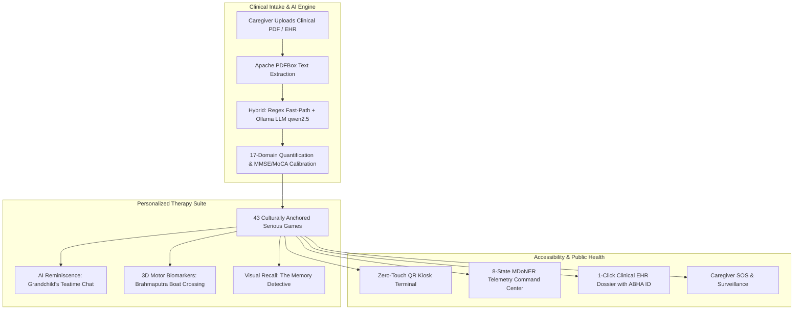

# CogniCare CDTx

> **AI-Powered Cognitive Digital Therapeutics (CDTx) & Memory Assistance Platform for Elderly Dementia Patients in the North Eastern Region (NER)**  
> *Proposed Solution for Ministry of Development of North Eastern Region (MDoNER) • Problem Statement ID: SIH26003*

---

## 🎯 Executive Summary

CogniCare is a clinically calibrated, culturally anchored Cognitive Digital Therapeutics (CDTx) platform engineered for elderly dementia, Alzheimer's, and Mild Cognitive Impairment (MCI) patients across the 8 North Eastern states of India.

It combines **43 serious cognitive games**, a **local Ollama LLM** clinical report extraction pipeline and conversational reminiscence engine, **11 regional languages with zero-flicker switching**, **zero-touch QR kiosk authentication**, **continuous neuropsychological motor biomarkers**, an 8-state MDoNER telemetry command center, and a full mission-control admin panel — all running 100% offline-first for patient privacy.



---

## 📁 Repository Layout

| Path | Description |
|---|---|
| `frontend/` | Next.js 16.3.3 application — patient/caregiver/admin experience, games, i18n, SEO |
| `backend/` | Spring Boot 4.1 REST service — patient records, JWT auth, PDF clinical extraction, surveillance/SOS, admin mission-control |
| `omkar/` | Standalone sub-project demo games (A-Day-in-My-World, Bazaar Buddies, Memory Garden, Memory Road) |

> **Detailed technical references:** `frontend/INFO.md` and `backend/INFO.md`.

---

## 🌟 Key Platform Innovations

### 1. 🎮 43 Serious Cognitive Games
- Categorized into **5 clinical domains**: `vision-3d`, `reminiscence`, `attention`, `iadl` (Instrumental ADL), `calm`.
- Flagship experiences include *A Day in My World*, *Majuli Walk 3D*, *Tea Garden Harvest Vision*, *Bihu Dhol Beats*, *Voice of Brahmaputra*, *Grandchild's Teatime Chat* (AI reminiscence), *Brahmaputra Boat Crossing* (3D motor kinematics), and *The Memory Detective* (facial/episodic recall).
- Each game exposes a server-safe metadata record (`games/meta.ts`) with a cognitive domain and i18n title/description keys; `games/config.ts` provides clinical algorithms (scaffolding, spaced retrieval, kinetic smoothing, severity staging).

### 2. 🤖 Local Ollama AI Clinical Pipeline
- **Hybrid extraction**: Apache PDFBox text → regex fast-path (MMSE/MoCA, ICD-10, MTA/Fazekas grades, physician) → rule-based 17-domain derivation → Ollama LLM polish + merge (deterministic metrics are never overwritten).
- **17 domains**: 7 cognitive + 6 IADLs + 4 behavioral; maps to Level 1/2/3 baseline difficulty.
- **100% on-device / offline privacy** — no patient health information leaves the local clinic.

### 3. 🌐 11 Regional Languages & Zero-Flicker Architecture
- `en hi as mr bn ne mni lus kha brx grt` — English, Hindi, Assamese, Marathi, Bengali, Nepali, Meitei (Manipuri), Mizo, Khasi, Bodo, Garo.
- English-first **deep-merge fallback** so missing keys never render blank; React 19 `useTransition` smooth route change; SSR-safe `useSyncExternalStore` state persistence (no hydration flash).

### 4. 🪪 Zero-Touch QR Kiosk Login (`/kiosk/login`)
- Optical laser-reticle scanner (webcam), multi-sensory Web Audio feedback (`playScanSuccess`, `playError`), spoken greeting, and instant JWT auto-redirect to the patient dashboard.
- Demo path: **"Try Demo Patient"** calls `POST /api/v1/auth/kiosk/demo` (real patient `id=2`, Biren Borah, Assamese) with an offline fallback session.

### 5. 📊 8-State MDoNER Command Center (`/command-center`) & Admin Panel
- Real-time GIS adherence/epidemiology across **Assam, Meghalaya, Manipur, Mizoram, Nagaland, Tripura, Arunachal Pradesh, and Sikkim**; Ayushman Bharat Digital Mission (ABDM/ABHA) compatibility.
- `/admin` mission-control with **14 tabs** (surveillance, regions, predictive, tele-manas, medications, burnout, alerts, incentives, broadcast, patients, sessions, AI, kiosks, cultural, audit) backed by the backend admin API.

### 6. ♿ GIGW AAA Accessibility
- 3-tier elderly font scaling (16 / 18 / 22 px), high-contrast AAA mode, tactile neo-brutalist buttons, and severity-calibrated speech rate.

### 7. 🔐 Caregiver SOS & Surveillance
- Continuous vitals/biomarker ingest, geofence + vital auto-alerts, and a patient-facing SOS that raises a CRITICAL `SOS_CALL_CAREGIVER` alert; the caregiver app polls `sos/latest` and 404/logs out when a patient record is gone.

---

## 🛠️ Technical Stack

| Layer | Technologies | Key Highlights |
|---|---|---|
| **Frontend** | Next.js 16.3.3, React 19.2, TypeScript 5, Tailwind 4, Three.js, recharts 3, next-intl 4, zustand, MediaPipe tasks-vision, html5-qrcode, gsap | Zero-flicker i18n, Web Audio/TTS, 3D kinematics, SSR + `next/dynamic` code splitting |
| **Backend** | Spring Boot 4.1, Java 17, Spring Data JPA, Hibernate, Apache PDFBox 3.0.3, hand-rolled HS256 JWT | REST API, multipart upload, JWT auth (fail-open on `/patients/**`), surveillance/SOS |
| **AI / LLM** | Ollama (`qwen2.5:1.5b` / `llama3.2:3b`) | Offline-first clinical report analysis + conversational reminiscence |
| **Database** | MariaDB (default) / H2 file-backed (demo profile) | Multi-patient medical schemas, family albums, biomarker/surveillance history |

---

## 🚀 Quick Start Guide

### Prerequisites
- **Node.js** 18+ & **JDK** 17+
- **Ollama**: `ollama pull qwen2.5:1.5b` (optional `llama3.2:3b`)

### Running the Full System

```bash
# 1. Start Backend
#   Default profile → MariaDB (localhost:3306, root/root123, db `cognicare`; auto-creates)
cd backend
./mvnw -o spring-boot:run

#   OR zero-config demo profile → file-backed H2 (./data/cognicare.mv.db)
./mvnw -o spring-boot:run -Dspring-boot.run.profiles=demo

# 2. Seed demo surveillance data (optional; demo patients already exist at ids 1–2)
curl -X POST http://localhost:8080/surveillance/simulate   # optional surveillance demo data

# 3. Start Frontend (production build) or dev
cd frontend
npm install
npm run dev
# production: npm run build && npm run start
```

### Key URLs
| Portal | URL |
|---|---|
| Home | `http://localhost:3000/en` |
| Patient Kiosk (QR / demo) | `http://localhost:3000/en/kiosk/login` |
| Caregiver Dashboard | `http://localhost:3000/en/caregiver` |
| Admin Mission Control | `http://localhost:3000/en/admin` |
| MDoNER Command Center | `http://localhost:3000/en/command-center` |
| Games Hub | `http://localhost:3000/en/patient/games` |
| Backend API base | `http://localhost:8080/api/v1` |
| Backend admin/surveillance | `http://localhost:8080/admin/**` , `/surveillance/**` |
| Uploaded media | `http://localhost:8080/uploads/**` |
| H2 console (demo profile) | `http://localhost:8080/h2-console` |

---

## 🧪 Verification

```bash
# Frontend
cd frontend
npm run lint && npx tsc --noEmit && npm run build

# Backend
cd backend
./mvnw -o compile
```

---

## 📦 Delivery Notes

- **SEO/Performance**: unique per-route metadata + canonical/hreflang for all 11 locales, centralized `SITE_URL`, cache headers (`immutable`, 1yr) for `/wasm`, `/models`, `/sample-images`, lazy-loaded Three.js/recharts via `next/dynamic`, `550` sitemap URLs.
- **Offline-first**: AI/LLM and patient data never leave the clinic/devices; media cached for reuse.
- *SIH 2026 — Problem Statement SIH26003.*