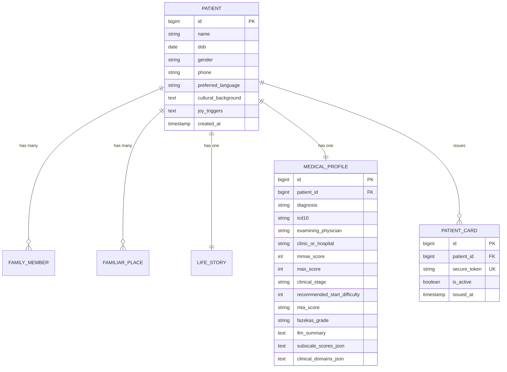
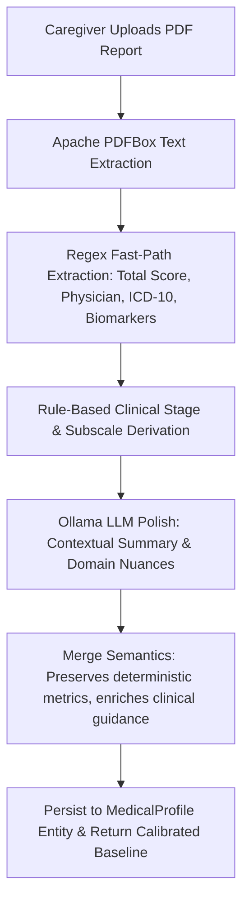

# CogniCare Backend — Technical Reference & Presentation Summary

> **Comprehensive Reference for SIH 2026 Presentation & Pitch Deck Creation**  
> Covers Architecture, Schema, Hybrid Ollama Clinical Extraction, QR Kiosk Authentication, and REST APIs.

---

## 1. Project Identity & Architecture

| Field | Value |
|---|---|
| **System Name** | CogniCare Backend Service |
| **Problem Statement** | SIH26003 — AI-Based Cognitive Gaming & Memory Assistance for Elderly Dementia Patients (NER India) |
| **Framework & Runtime** | Spring Boot 4.1.1, Java 17, Spring Data JPA / Hibernate |
| **Server Port & Base URL** | Port `8080` • Prefix `/api/v1` |
| **AI Engine** | Local Ollama REST API (`qwen2.5:1.5b` / `llama3.2:3b`) |
| **Primary Databases** | MariaDB (Production: port 3306) / H2 Embedded (Zero-Config Demo Profile) |
| **PDF Extraction** | Apache PDFBox 3.0.3 |

---

## 2. Package & Layer Architecture

```
com.sih.cognicare/
├── CognicareApplication.java          # Spring Boot main application entry
├── config/
│   ├── CorsConfig.java                # CORS policy (allows http://localhost:3000)
│   ├── AppConfig.java                 # ObjectMapper configuration (JavaTimeModule)
│   └── WebConfig.java                 # Static file resource handler (/uploads/**)
├── controller/
│   ├── PatientController.java         # Patient onboarding, getters, family/place photos
│   └── KioskAuthController.java       # Zero-touch QR kiosk authentication endpoint
├── dto/
│   ├── OnboardRequest.java            # Multi-part intake payload
│   ├── PatientOnboardResponse.java    # Onboarding result + clinical calibration
│   ├── MedicalProfileResponse.java    # 17-domain quantified scores + subscale breakdown
│   ├── KioskScanRequest.java          # QR code cryptographic payload
│   └── KioskScanResponse.java         # Session JWT token + patient profile
├── model/
│   ├── Patient.java                   # Root patient aggregate entity
│   ├── FamilyMember.java              # Family portraits and relationships
│   ├── FamiliarPlace.java             # Visual landmarks and wayfinding cues
│   ├── LifeStory.java                 # Career, hobbies, music, milestones
│   ├── MedicalProfile.java            # Clinical MMSE scores, biomarkers, LLM analysis
│   └── PatientCard.java               # Active QR token and issue timestamp
├── repository/
│   ├── PatientRepository.java         # JpaRepository<Patient, Long>
│   ├── FamilyMemberRepository.java    # findByPatientId
│   ├── FamiliarPlaceRepository.java   # findByPatientId
│   ├── LifeStoryRepository.java       # findByPatientId
│   ├── MedicalProfileRepository.java  # findByPatientId
│   └── PatientCardRepository.java     # findTopBySecureTokenAndIsActiveTrue
├── service/
│   ├── FileStorageService.java        # Disk file storage (UUID naming under /uploads)
│   ├── MedicalReportService.java      # PDF extraction → Regex metrics → Ollama analysis
│   ├── PatientCardService.java        # QR health card generation & kiosk validation
│   └── JwtService.java                # Stateless JWT session token issuance
└── exception/
    ├── PatientNotFoundException.java  # 404 handler
    └── InvalidQrTokenException.java   # 401 unauthenticated QR handler
```

---

## 3. Database Schema Overview



---

## 4. Hybrid AI Clinical Extraction Pipeline



### Clinical Stage Calibration Rubric
| MMSE / MoCA Score | Clinical Stage | Baseline Difficulty | Assist Level |
|---|---|---|---|
| **$\ge$ 24 / 30** | **MCI / Mild** | Level 3 (Adaptive) | Minimal assistance, 4x4 grid, 5s reaction window |
| **18 – 23 / 30** | **Early Dementia** | Level 2 (Standard) | Moderate assistance, 3x3 grid, 10s reaction window |
| **10 – 17 / 30** | **Moderate Dementia** | Level 1 (Assisted) | High guidance, 2x2 grid, 15s reaction window, audio cues |
| **$<$ 10 / 30** | **Severe Dementia** | Level 1 (High Assist) | Maximum guidance, 20s reaction window, 0.75x slow voice prompt |

### 17 Extracted Clinical Domains
1. **Cognitive (7)**: *Memory, Attention, Executive Function, Orientation, Language, Visuospatial, Decision Making*.
2. **IADLs (6)**: *Medication Management, Financial Management, Navigation, Meal Preparation, Driving, Household Tasks*.
3. **Behavioral (4)**: *Apathy, Agitation, Social Withdrawal, Sleep Disturbance*.

---

## 5. REST API Endpoints Summary

| Method | Endpoint | Description |
|---|---|---|
| `POST` | `/api/v1/patients/onboard` | Multi-part onboarding: personal info, family photos, landmarks, life story, and medical PDF |
| `GET` | `/api/v1/patients/{id}` | Complete patient profile, medical records, and demographic details |
| `GET` | `/api/v1/patients/{id}/medical-profile` | 17-domain quantified breakdown and MMSE subscale scores |
| `GET` | `/api/v1/patients/{id}/family` | Family members list with photo URLs for facial recognition games |
| `GET` | `/api/v1/patients/{id}/places` | Familiar landmarks and descriptions for wayfinding games |
| `GET` | `/api/v1/caregiver/patients/{id}/card` | Generates or retrieves active QR Health Card secure token |
| `POST` | `/api/v1/auth/kiosk/scan` | Zero-touch kiosk login: validates card token and returns session JWT |
| `GET` | `/api/v1/uploads/**` | Static media file server (photos, PDFs) with CORS support |

---

## 6. Execution & Verification

```bash
# 1. Pull lightweight Ollama model
ollama pull qwen2.5:1.5b

# 2. Start backend in H2 demo mode (zero setup)
cd backend
./mvnw spring-boot:run -Dspring-boot.run.profiles=demo

# 3. Start backend in MariaDB production mode
./mvnw spring-boot:run
```

- **Build Status**: Verified with `mvn compile` (BUILD SUCCESS).
