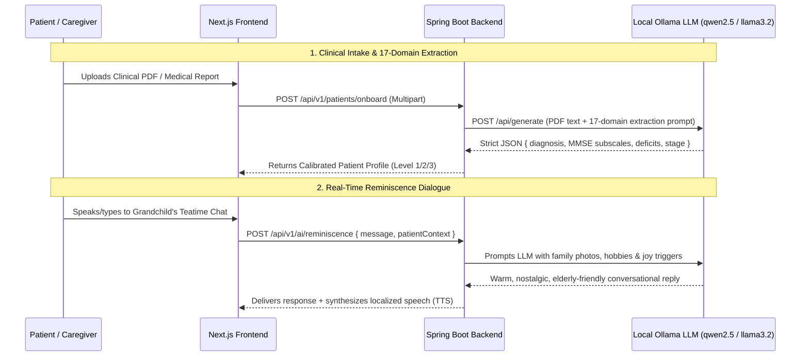

# CogniCare Frontend — Technical Reference & Presentation Summary

> **Comprehensive Reference for SIH 2026 Presentation & Pitch Deck Creation**  
> Covers Architecture, 18 CDTx Games, Ollama AI Integration, 11-Language i18n, Kiosk QR Scanner, and Regional Telemetry.

---

## 1. Executive Summary & Core Highlights

- **Framework**: Next.js 16.3.3 (Turbopack) + React 19 + TypeScript + Tailwind CSS 4.
- **Visual Design System**: Neo-brutalist clinical scrapbook UI with paper texture overlays, tactile 3D chunky buttons, and GIGW compliance.
- **18 Serious Clinical Games**: Categorized across Memory Recall, Spatial Orientation, Executive Function, Attention, Kinematic Motor Tracking, and Multi-Turn AI Reminiscence.
- **11 Regional Languages**: Zero-flicker switching across 8 North Eastern languages + Pan-Indian languages.
- **Zero-Touch Kiosk Terminal**: Optical laser scanning reticle, Web Audio feedback (`playScanSuccess`), voice guidance, and instant auto-redirect.
- **MDoNER Command Center**: 8-state GIS telemetry dashboard and live clinical session feed.

---

## 2. 18 Cognitive Digital Therapeutics (CDTx) Games Portfolio

| Game ID | Title | Cognitive Domain | Modality / Tech | Cultural Anchor |
|---|---|---|---|---|
| `grandchild-chat` | **Grandchild's Teatime Chat** | Reminiscence & Emotional Well-Being | Multi-turn Ollama LLM Dialogue | Traditional Morning Tea Dialogue |
| `memory-detective` | **The Memory Detective** | Face & Episodic Memory Recall | 3-Tier Multi-Modal Clue Elimination | Family & Community Album |
| `storybook` | **Living Chronicle** | Autobiographical Narrative Recall | Interactive Photo Scrapbook | Life Milestones & Timeline |
| `jigsaw` | **Jigsaw Puzzle Engine** | Visuospatial & Fine Motor | Canvas 2D Interlocking Snap Engine | Heritage Landmark Photos |
| `river-crossing` | **Brahmaputra Boat Crossing** | Visuospatial & Motor Kinematics | 3D Three.js + Micro-hesitation Tracking | Brahmaputra River Navigation |
| `weaving-loom` | **Assam Weaving Loom** | Pattern Recognition & Motor Curve | Grid Target & Curve Kinematics | Assamese Gamosa Weaving |
| `wayfinding` | **Village Wayfinding** | Spatial Memory & Orientation | Milestone Landmark Route Traversal | Village Paths & Landmarks |
| `tea-harvest` | **Assam Tea Harvest** | Visual Attention & Reaction Time | Two-Leaf-and-a-Bud Selector | Assam Tea Gardens |
| `radio` | **Akashvani Radio** | Auditory Processing & Tuning | Audio Frequency Dial Alignment | Vintage All India Radio |
| `root-bridge` | **Living Root Bridge** | Sequential Planning & Logic | Stepwise Bridge Path Assembly | Cherrapunji Meghalaya Bridges |
| `heritage-kitchen` | **Heritage Kitchen** | Working Memory & Recipe Sequencing | Ingredient Drag-and-Drop | North Eastern Culinary Recipes |
| `lotus-lake` | **Lotus Lake Match** | Visual Search & Concentration | Serene Lake Reflection Pairs | Northeast Lotus Lakes |
| `bihu-rhythm` | **Bihu Drum Rhythm** | Auditory-Motor Synchronization | Dhol Beat Tempo Tapping | Assamese Bihu Festival |
| `majuli-masks` | **Majuli Mask Studio** | Shape Recognition & Symmetry | Traditional Mask Reconstruction | Majuli Island Art Forms |
| `loktak-lake` | **Loktak Floating Phumdis** | Spatial Navigation & Balance | Circular Island Stepping Stones | Loktak Lake, Manipur |
| `hornbill-headdress` | **Hornbill Headdress** | Color Matching & Sequence Recall | Feather & Bead Patterning | Nagaland Hornbill Festival |
| `monastery-wheel` | **Monastery Prayer Wheel** | Motor Coordination & Calming Rhythm | Continuous Rotational Gesture | Tawang Monastery, Arunachal |
| `orchid-sanctuary` | **Orchid Sanctuary** | Fine Detail Discrimination | Botanical Species Matching | Sessa Orchid Sanctuary |

---

## 3. Ollama AI Local Inference Engine

---

## 4. 11 Regional Languages & Zero-Flicker Architecture

### Supported Language Matrix
1. **Assamese (অসমীয়া)** — `as` (Assam)
2. **Bengali (বাংলা)** — `bn` (Tripura, Assam, West Bengal)
3. **Hindi (हिन्दी)** — `hi` (Pan-India)
4. **Marathi (मराठी)** — `mr` (Maharashtra / Clinical Partners)
5. **Khasi** — `kha` (Meghalaya)
6. **Garo** — `grt` (Meghalaya)
7. **Manipuri / Meeteilon (মৈতৈলোন্)** — `mni` (Manipur)
8. **Mizo** — `lus` (Mizoram)
9. **Bodo** — `brx` (Bodoland, Assam)
10. **Nepali** — `ne` (Sikkim, North Bengal)
11. **English** — `en` (Default clinical base)

### Zero-Flicker Engineering
- **Deep Fallback Resolution**: Always loads `en.json` base messages and overlays target locale messages on top to prevent blank labels.
- **React 19 `useTransition`**: Switches routes smoothly with `{ scroll: false }` without unmounting layout frames.
- **`useSyncExternalStore` Persistence**: Stores font size (`cognicare_font_size`) and high contrast mode in `localStorage` with synchronous pre-paint application to eliminate SSR hydration flashes.

---

## 5. Accessibility & GIGW AAA Compliance

| Feature | Specifications | Purpose |
|---|---|---|
| **Elderly Font Scaler** | **`16px`** (Compact) • **`18px`** (Default) • **`22px`** (Large) | Optimized for elderly patients with presbyopia or mild cognitive visual deficit |
| **GIGW High-Contrast** | Black `#000000` & Yellow `#FBBF24` / Emerald `#059669` | AAA standard for low-vision legibility and outdoor sunlight kiosk usage |
| **Tactile Buttons** | Neo-brutalist chunky 3D borders (`border-3 border-black shadow-[4px_4px_0px_#000]`) | High physical affordance for elderly users with impaired fine-motor control |
| **Speech Rate Calibration** | Automated speech rate adjustment (`0.75x` for Severe, `0.85x` for Moderate, `1.0x` for Mild) | Comprehension support for auditory processing lag |

---

## 6. Zero-Touch QR Kiosk Terminal (`/kiosk/login`)

- **Viewfinder HUD**: Clean single square reticle with 4 emerald corner guides and animated sweeping green laser line.
- **Camera Selection**: Flip toggle between Front and Rear cameras with voice guidance audio prompt.
- **Multi-Sensory Audio**:
  - `playTapFeedback()`: Subtle scanner detection beep.
  - `playScanSuccess()`: Triple-note fanfare on cryptographic token match.
  - `playError()`: Low warning buzz on invalid or unreadable cards.
  - Speech synthesis: Automatic verbal greeting (*"Welcome, [Patient Name]!"*).
- **Smooth Auto-Redirect**: Automatically signs the patient in and navigates to `/patient`.

---

## 7. MDoNER Command Center & Clinical Dossier Export

- **8-State Telemetry Hub (`/command-center`)**: GIS adherence metrics, district clusters, and active session telemetry covering all 8 North Eastern states.
- **1-Click Clinical EHR Export**: Instant printable dossier with ABHA Health ID, 5-Axis Neuropsychological Radar, motor latency metrics, and verifiable QR codes.
